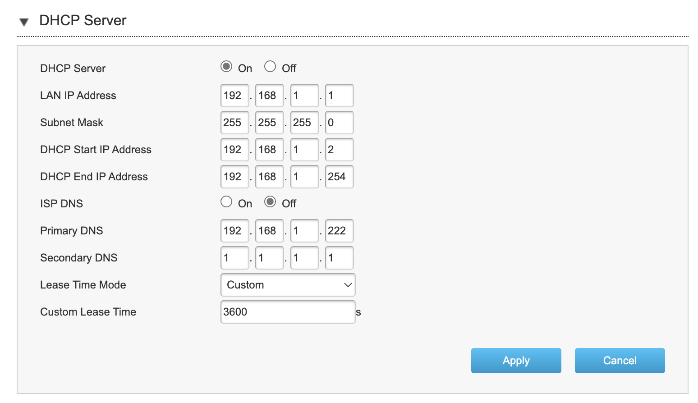

# Adguard Home

## Port 53 in used
Check out the main website about Adguard Home: https://adguard.com/en/adguard-home/overview.html

Before run the install command, ensure the port 53 is not used by other DNS service (Cloudflare warp, VPN, etc). If it does, might have to remove it (Checkout this https://github.com/AdguardTeam/AdGuardHome/wiki/FAQ#webaddr)

Command for checking the port 53:
```bash
sudo lsof -i :53
```

The output should look like:
```
COMMAND     PID            USER   FD   TYPE DEVICE SIZE/OFF NODE NAME
systemd-r 14542 systemd-resolve   13u  IPv4  86178      0t0  UDP 127.0.0.53:domain
systemd-r 14542 systemd-resolve   14u  IPv4  86179      0t0  TCP 127.0.0.53:domain
```

To solve it:
Create the /etc/systemd/resolved.conf.d directory, if necessary:

```bash
sudo mkdir -p /etc/systemd/resolved.conf.d
```

Deactivate DNSStubListener and update DNS server address. To do that, create a new file, /etc/systemd/resolved.conf.d/adguardhome.conf, with the following content:

```
[Resolve]
DNS=127.0.0.1
DNSStubListener=no
```

Specifying 127.0.0.1 as DNS server address is necessary because otherwise the nameserver will be 127.0.0.53 which doesn't work without DNSStubListener.

Activate another resolv.conf file:
```
sudo mv /etc/resolv.conf /etc/resolv.conf.backup
sudo ln -s /run/systemd/resolve/resolv.conf /etc/resolv.conf
```
Restart DNSStubListener:

```
sudo systemctl reload-or-restart systemd-resolved
```

*Notes:* Sometimes, warp-cli or tailscale overwrite the `/etc/systemd/resolved.conf` and might need to restore to default to able re-gain internet access.


## Install
Automated install (Linux/Unix/MacOS/FreeBSD/OpenBSD)
To install with curl run the following command:

```
curl -s -S -L https://raw.githubusercontent.com/AdguardTeam/AdGuardHome/master/scripts/install.sh | sh -s -- -v
```
To install with wget run the following command:
```
wget --no-verbose -O - https://raw.githubusercontent.com/AdguardTeam/AdGuardHome/master/scripts/install.sh | sh -s -- -v
```
To install with fetch run the following command:
```
fetch -o - https://raw.githubusercontent.com/AdguardTeam/AdGuardHome/master/scripts/install.sh | sh -s -- -v
```
The script also accepts some options:

- -c <channel> to use specified channel;
- -r to reinstall AdGuard Home;
- -u to uninstall AdGuard Home;
- -v for verbose output.
Note that options -r and -u are mutually exclusive.

# Web UI
After start the Adguard Home, access it via port 81 and set config follow their instruct.

## DNS Setting
Change the DNS setting for better upstream source, check out the list of available option here: [https://adguard-dns.io/kb/general/dns-providers/](https://adguard-dns.io/kb/general/dns-providers/?clid=2JA1Aa--iUKMmY&utm_campaign=dns_kb_providers&utm_medium=ui&utm_source=home)

*Notes:* `DNS-over-HTTPS` can sometimes bypass blocked website from ISP (e.g. viettel)

## DHCP Config
Access to router for config the internet routing though adguard before go to edge devices. 
* Step 1: Add static IP for adguard home device (e.g. 192.168.1.222) at LAN setting
* Step 2: Replace the ISP default DHCP server with our adguard home IP
* (Optional) Step 3: Add a fallback DNS server (e.g. 1.1.1.1)


