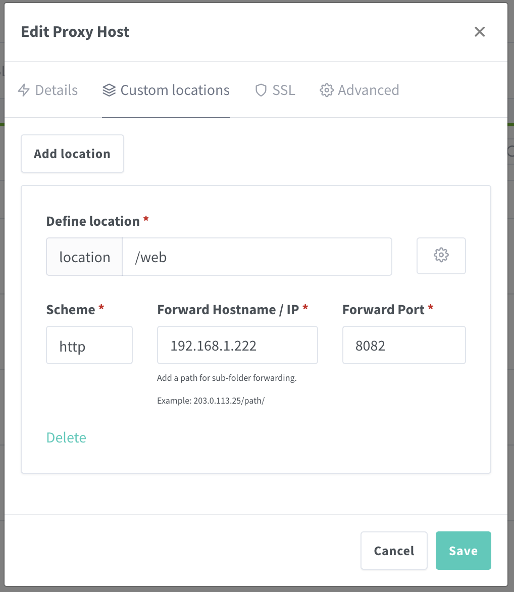

# Headscale and UI

## Install
Download the `config.yaml` from headscale https://headscale.net/stable/setup/install/container/#configure-and-run-headscale
```bash
curl -o config.yaml https://raw.githubusercontent.com/juanfont/headscale/main/config-example.yaml
```

Change the config accordingly to our domain:
```yaml
# The url clients will connect to.
# Typically this will be a domain like:
#
# https://myheadscale.example.com:443
#
server_url: https://hs.nmd2k.io.vn # <--- This line

# Address to listen to / bind to on the server
#
# For production:
**listen_addr: 0.0.0.0:8080 # <--- This line
# listen_addr: 127.0.0.1:8080
```
Execute docker compose: [docker-compose.yml](./docker-compose.yml)

## Login
To check if headscale is up, let's assume our domain is `hs.nmd2k.io.vn`, try:

```bash
curl -I https://hs.nmd2k.io.vn/health
```

It should ouput something like "pass"

To login on devices, try:
```bash 
tailscale up --login-server https://hs.nmd2k.io.vn

# If tailscale not installed
# curl -fsSL https://tailscale.com/install.sh | sh
```

And at our server, try to (1) regis a user, (2) regis a node:
```bash
docker compose exec headscale \
  headscale users create nmd2k


docker compose exec headscale \
  headscale nodes register --user nmd2k --key <YOUR_MACHINE_KEY>
# The key should appear when try to login by tailscale
```
*Notes*: Same thing with mobile but instead we have an app and you might need to copy the key to other machine where you can enter it to headscale (or via web UI)

## Proxy Nginx Manager
If you use proxy nginx manager, you might need to add another location like in this immage for headscale-ui. I used port 8082 for not overlap with other service (check out the docker compose file)




